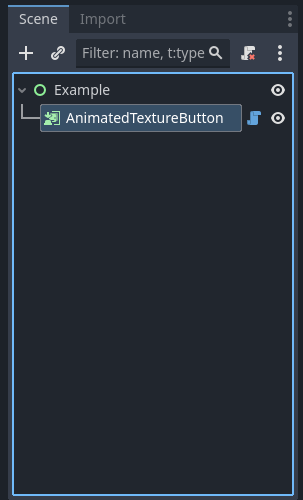
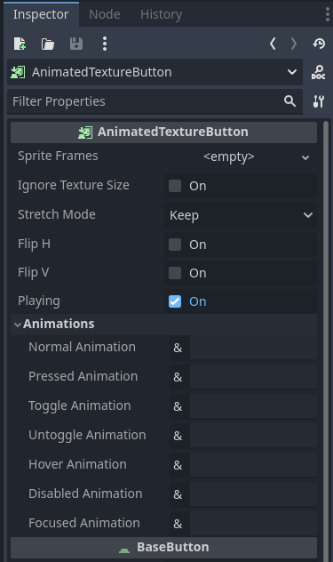

<h1>AnimatedTextureButton</h1>

Button displayed using animated sprite frames

## Description

Used for creating buttons where the various buttons states are displayed as animations. Utilizes a [SpriteFrames](https://docs.godotengine.org/en/stable/classes/class_spriteframes.html) resourse for texture and animation data. Buttons states are defined as the animation within the defined [SpriteFrames](https://docs.godotengine.org/en/stable/classes/class_spriteframes.html) resource to use for any specific state.

## In Editor Screenshots

|                                                                                                                       |                                                                                                                     |
| --------------------------------------------------------------------------------------------------------------------- | ------------------------------------------------------------------------------------------------------------------- |
|  |  |
| AnimatedTextureButton in a scene tree.                                                                                | AnimatedTextureButton inspector options.                                                                            |

## Properties

| Name                                                            | Type                                                                                   | Description                                                                                                                                                                      |
| --------------------------------------------------------------- | -------------------------------------------------------------------------------------- | -------------------------------------------------------------------------------------------------------------------------------------------------------------------------------- |
| <a href="#property-sprite_frames">sprite_frames</a>             | [SpriteFrames](https://docs.godotengine.org/en/stable/classes/class_spriteframes.html) | The texture and animations resource used for the visual representations of the button.                                                                                           |
| <a href="#property-ignore_texture_size">ignore_texture_size</a> | **bool**                                                                               | If `true`, the size of the texture won't be considered for minimum size calculations, allowing the *AnimatedTextureButton* to be shrunk down past the texture size.              |
| <a href="#property-stretch_mode">stretch_mode</a>               | **TextureHelper.StretchMode**                                                          | Controls the texture's behaviour when resizing the node's bounding rectangle.                                                                                                    |
| <a href="#property-flip_h">flip_h</a>                           | **bool**                                                                               | If `true`, flips the texture horizontally.                                                                                                                                       |
| <a href="#property-flip_v">flip_v</a>                           | **bool**                                                                               | If `true`, flips the texture vertically.                                                                                                                                         |
| <a href="#property-playing">playing</a>                         | **bool**                                                                               | If `true`, will play animation in editor window.                                                                                                                                 |
| <a href="#property-normal_animation">normal_animation</a>       | **StringName**                                                                         | Animation to play by default when not pressed, toggled, or in the hover state.                                                                                                   |
| <a href="#property-pressed_animation">pressed_animation</a>     | **StringName**                                                                         | Animation to play on mouse down over the node, or the node has keyboard focus and the user pressed the Enter or BaseButton.shortcut key.                                         |
| <a href="#property-toggle_animation">toggle_animation</a>       | **StringName**                                                                         | Animation to play when pressed on and `toggle_mode` is `true`. If animation is not looping, upon completion, the pressed state will become active.                               |
| <a href="#property-untoggle_animation">untoggle_animation</a>   | **StringName**                                                                         | Animation to play when pressed off and `toggle_mode` is `true`. If animation is not looping, upon completion, animation will change to normal or hover depending on mouse state. |
| <a href="#property-hover_animation">hover_animation</a>         | **StringName**                                                                         | Animation to play when mouse hovers the node.                                                                                                                                    |
| <a href="#property-disabled_animation">disabled_animation</a>   | **StringName**                                                                         | Animation to play when node is disabled.                                                                                                                                         |
| <a href="#property-focused_animation">focused_animation</a>     | **StringName**                                                                         | Animation to play when node has mouse or keyboard focus. Animation will be displayed over the base animation.                                                                    |

## Signals

<a href="#signal-animation_finished">animation_finished</a>(anim_name: **StringName**)

> Signal emitted when a non-looped animation finishes.

---

<a href="#signal-animation_looped">animation_looped</a>(anim_name: **StringName**)

> Signal emitted when a loop animation finished a sequence and is about to start again.

