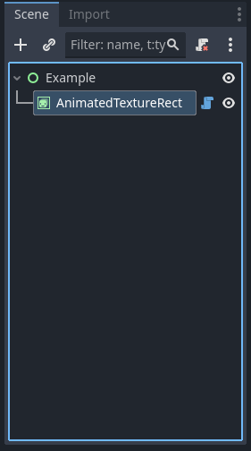
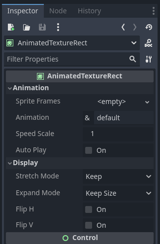

<center></center>
<center><h1>AnimatedTextureRect</h1></center>

A control that displays an animation in a GUI

## Description

A control similar to a TextureRect node, but displays the selected animation from a SpriteFrames resource. Can be used for animated icons within a GUI. The texture's placement can be controlled with the stretch_mode property. It can scale, tile, or stay centered inside its bounding rectangle.

## In Editor Screenshots

|                                                                                                                   |                                                                                                              |
| ----------------------------------------------------------------------------------------------------------------- | ------------------------------------------------------------------------------------------------------------ |
|  |  |
| AnimatedTextureRect in a scene tree.                                                                              | AnimatedTextureRect inspector options.                                                                       |

## Properties

| Name                                                  | Type                                                                                   | Description                                                                                                                                                                                                                |
| ----------------------------------------------------- | -------------------------------------------------------------------------------------- | -------------------------------------------------------------------------------------------------------------------------------------------------------------------------------------------------------------------------- |
| <a href="#property-sprite_frames">sprite_frames</a>   | [SpriteFrames](https://docs.godotengine.org/en/stable/classes/class_spriteframes.html) | The SpriteFrames resource containing the animation(s) and texture(s) data.                                                                                                                                                 |
| <a href="#property-animation">animation</a>           | **StringName**                                                                         | Current animation from the SpriteFrames resource.                                                                                                                                                                          |
| <a href="#property-speed_scale">speed_scale</a>       | **float**                                                                              | The speed scaling ratio. For example, if this value is `1.0`, then the animation plays at normal speed. If the value is  `0.5`, animation plays at half speed. If the value is `2.0`, the animation plays at double speed. |
| <a href="#property-frame">frame</a>                   | **int**                                                                                | The current frame in the active animation. If no animation is defined, the index will be `0`                                                                                                                               |
| <a href="#property-frame_progress">frame_progress</a> | **float**                                                                              | The progress through the current frame in the active animation. If no animation is defined, the value will be `0.0`                                                                                                        |
| <a href="#property-auto_play">auto_play</a>           | **bool**                                                                               | Automatically play animation in the editor.                                                                                                                                                                                |
| <a href="#property-stretch_mode">stretch_mode</a>     | **TextureHelper.StretchMode**                                                          | Controls the texture's behaviour when resizing the node's bounding rectangle.                                                                                                                                              |
| <a href="#property-expand_mode">expand_mode</a>       | **TextureHelper.ExpandMode**                                                           | Defines how minimum size is determined based on texture size.                                                                                                                                                              |
| <a href="#property-flip_h">flip_h</a>                 | **bool**                                                                               | If `true`, flips the texture horizontally.                                                                                                                                                                                 |
| <a href="#property-flip_v">flip_v</a>                 | **bool**                                                                               | If `true`, flips the texture vertically.                                                                                                                                                                                   |

## 

## Public Methods

| Return    | Method Name                                                                                   |
| --------- | --------------------------------------------------------------------------------------------- |
| **float** | [get_playing_speed](#method-get_playing_speed) ()                                             |
| **bool**  | [is_playing](#method-is_playing)()                                                            |
| **void**  | [play](#method-play)(anim_name: **StringName**, custom_speed: **float**, from_end: **bool**)  |
| **void**  | [play_backwards](#method-play_backwards)(anim_name: **StringName**)                           |
| **void**  | [pause](#method-pause)()                                                                      |
| **void**  | [stop](#method-stop)()                                                                        |
| **void**  | [set_frame_and_progress](#method-set_frame_and_progress)(frame: **int**, progress: **float**) |

## Signals

<a href="#signal-animation_finished">animation_finished</a>(anim_name: **StringName**)

> Signal emitted when a non-looped animation finishes.

---

<a href="#signal-animation_looped">animation_looped</a>(anim_name: **StringName**)

> Signal emitted when a loop animation finished a sequence and is about to start again.

## 

## Public Method Descriptions

<a href="#method-get_playing_speed">get_playing_speed</a> () -> **void**

> Returns the actual playing speed of current animation or `0` if not playing. This speed is the [speed_scale](#property-speed_scale) property multiplied by custom_speed argument specified when calling the [play](#method-play) method.
> 
> Returns a negative value if the current animation is playing backwards.

---

<a href="#method-is_playing">is_playing</a>() -> **bool**:

> Returns `true` if an animation is currently playing (even if speed_scale and/or custom_speed are `0.0`).

---

<a href="#method-play">play</a>(anim_name: **StringName**, custom_speed: **float**, from_end: **bool**) -> **void**

> Plays the animation with key `anim_name`. If `custom_speed` is negative and `from_end` is `true`, the animation will play backwards (which is equivalent to calling [play_backwards](#method-play_backwards).
> 
> If this method is called with that same animation name, or with no name parameter, the assigned animation will resume playing if it was paused.

| Parameter        | Description                                                                                     |
| ---------------- | ----------------------------------------------------------------------------------------------- |
| **anim_name**    | The name within [sprite_frames](#property-sprite_frames) of the animation to play.              |
| **custom_speed** | Speed multiplier by which to play the animation. Negative values play the animation in reverse. |
| **from_end**     | If `true` the animation will start playing starting from the last frame in the animation.       |

---

<a href="#method-play_backwards">play_backwards</a>(anim_name: **StringName**) -> **void**

> Plays the animation with key name in reverse.
> 
> This method is shorthand for `play(anim_name, -1.0, true)`

| Parameter     | Description                                                                        |
| ------------- | ---------------------------------------------------------------------------------- |
| **anim_name** | The name within [sprite_frames](#property-sprite_frames) of the animation to play. |

---

<a href="#method-pause">pause</a>() -> **void**

> Pauses the currently playing animation. 
> 
> Calling [pause](#method-play), or calling [play](#method-play) or [play_backwards](#method-play_backwards) without arguments will resume the animation from the current playback position.
> 
> See also [stop](#method-stop).

---

<a href="#method-stop">stop</a>() -> **void**

> Stops the currently playing animation.
> 
> The animation position is reset to `0` and the `custom_speed` is reset to `1.0`.
> 
> See also [pause](#method-pause).

---

<a href="#method-set_frame_and_progress">set_frame_and_progress</a>(frame: **int**, progress: **float**) -> **void**

> The setter of [frame](#property-frame) resets the [frame_progress](#property-frame_progress) to `0.0` implicitly, but this method avoids that.
> 
> This is useful when you want to carry over the current [frame_progress](#property-frame_progress) to another [frame](#property-frame).
> 
> **Example**
> 
> ```gdscript
> # Change the animation with keeping the frame index and progress.
> var current_frame = animated_tex_rect.get_frame()
> var current_progress = animated_tex_rect.get_frame_progress()
> animated_tex_rect.play("walk_another_skin")
> animated_tex_rect.set_frame_and_progress(current_frame, current_progress)
> ```
