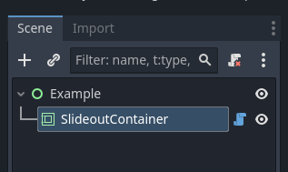
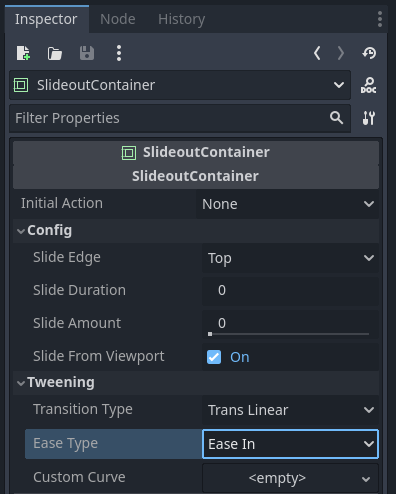

<h1>SlideoutContainer</h1>

A Container that tweens an offset of child positions outside of the container or the viewport.

## Description

Container will take up the amount of space required to fit all children with their combined minimum sizes and anchors. Primarily to be used to offset those children from inside the container (see [member slide_amount]) to either outside the container or outside the viewport (see [member slide_from_viewport).

## In Editor Screenshots

|                                                                                                               |                                                                                                             |
| ------------------------------------------------------------------------------------------------------------- | ----------------------------------------------------------------------------------------------------------- |
|  |  |
| SlideoutContainer in a scene tree.                                                                            | SlideoutContainer inspector options.                                                                        |

## Properties

| Name                                                        | Type                                                                                                 | Description                                                                                                                                                                                                                                                            |
| ----------------------------------------------------------- | ---------------------------------------------------------------------------------------------------- | ---------------------------------------------------------------------------------------------------------------------------------------------------------------------------------------------------------------------------------------------------------------------- |
| <a href="#property-initial_action">initial_action</a>       | [InitialAction](#ENUM-InitialAction)                                                                 | The action the container will take at initialization.                                                                                                                                                                                                                  |
| <a href="#property-slide_edge">slide_edge</a>               | [SlideEdge](#ENUM-SlideEdge)                                                                         | The edge children will be offset during a slide.                                                                                                                                                                                                                       |
| <a href="#property-slide_duration">slide_duration</a>       | **float**                                                                                            | The duration *(in seconds)* of a complete slide (from `0.0` to `1.0` or vice versa)                                                                                                                                                                                    |
| <a href="#property-slide_amount">slide_amount</a>           | **float**                                                                                            | The relative offset of the children in the container.  A value of `0.0` is completely within the container  A value of `1.0` is completely outside of the container *(or viewport)*.                                                                   |
| <a href="#property-slide_from_view">slide_from_viewport</a> | **bool**                                                                                             | If `true` the [slide_amount](#property-slide_amount) will offset the children between the container and outside the viewport.  If `false` the [slide_amount](#property-slide_amount) will offset the children between the container and outside the container. |
| <a href="#property-transition_type">transition_type</a>     | [Tween.TransitionType](https://docs.godotengine.org/en/stable/classes/class_tween.html#enumerations) | The transition type to use during a slide tween. **NOTE:** This value is ignored if a [custom_curve](#property-custom_curve) is defined.                                                                                                                               |
| <a href="#property-ease_type">ease_type</a>                 | [Tween.EaseType](https://docs.godotengine.org/en/stable/classes/class_tween.html#enumerations)       | The easing type to use during a slide tween. **NOTE:** This value is ignored if a [custom_curve](#property-custom_curve) is defined.                                                                                                                                   |
| <a href="#property-custom_curve">custom_curve</a>           | [Curve](https://docs.godotengine.org/en/stable/classes/class_curve.html)                             | **(OPTIONAL)** A custom curve used to determine the [slide_amount](#property-slide_amount) during a slide tween.  If left undefined, [transition_type](#property-transition_type) and [ease type](#property-ease_type) will be used.                           |

## 

## Public Methods

| Return   | Method Name                                                                                   |
| -------- | --------------------------------------------------------------------------------------------- |
| **void** | [slide_to](#method-slide_to) (target:**float**, duration:**float**, ignore_distance:**bool**) |
| **void** | [slide_in](#method-slide_in)(duration:**float**, ignore_distance:**bool**)                    |
| **void** | [slide_out](#method-slide_out)(duration:**float**, ignore_distance:**bool**)                  |
| **bool** | [is_sliding](#method-is_sliding)()                                                            |
| **void** | [stop_slide](#method-stop_sliding)()                                                          |

## Constants and ENUMs

**ENUM** <a href="#ENUM-InitialAction">InitialAction</a>

Some information here

---

**ENUM** <a href="#ENUM-SlideEdge">SlideEdge</a>

Some information here

## Signals

<a href="#signal-slide_started">slide_started</a>()

> Signal emitted when a slide is about to start.

---

<a href="#signal-slide_finished">slide_finished</a>()

> Signal emitted when a slide tween finishes.

---

<a href="#signal-slide_interrupted">slide_interrupted</a>()

> Signal emitted when a slide tween is interrupted or stopped.

## Public Method Descriptions

<a href="#method-slide_to">slide_to</a> (target:**float**, duration:**float**, ignore_distance:**bool**) -> **void**

> Initiates a slide for all children within the container.

| Parameter           | Description                                                                                                                                                                                                                                                                                                                               |
| ------------------- | ----------------------------------------------------------------------------------------------------------------------------------------------------------------------------------------------------------------------------------------------------------------------------------------------------------------------------------------- |
| **target**          | The target relative offset (see property [slide_amount](#property-slide_amount)) to tween to.                                                                                                                                                                                                                                             |
| **duration**        | *(Optional)* The duration *(in seconds)* a tween from `0.0` to `1.0` (and vice versa) should take.  If no value given (or the value is less than or equal to `0.0`), the value [slide_duration](#property-slide_duration) will be used.  NOTE:** The actual duration is adjusted for the existing offset of the children. |
| **ignore_distance** | *(Optional)* If `true`, duration will *NOT* be adjusted for distance.                                                                                                                                                                                                                                                                     |

---

<a href="#method-slide_in">slide_in</a>(duration:**float**, ignore_distance:**bool**) -> **void**

> Slides all children into the container.
> This is equivolent to `slide_to(0.0, duration, ignore_distance)`

| Parameter           | Description                                                                                                                                                                                                                                                                                                                               |
| ------------------- | ----------------------------------------------------------------------------------------------------------------------------------------------------------------------------------------------------------------------------------------------------------------------------------------------------------------------------------------- |
| **duration**        | *(Optional)* The duration *(in seconds)* a tween from `0.0` to `1.0` (and vice versa) should take.  If no value given (or the value is less than or equal to `0.0`), the value [slide_duration](#property-slide_duration) will be used.  NOTE:** The actual duration is adjusted for the existing offset of the children. |
| **ignore_distance** | *(Optional)* If `true`, duration will *NOT* be adjusted for distance.                                                                                                                                                                                                                                                                     |

---

<a href="#method-slide_out">slide_out</a>(duration:**float**, ignore_distance:**bool**) -> **void**

> Slides all children into the container.
> This is equivolent to `slide_to(1.0, duration, ignore_distance)`

| Parameter           | Description                                                                                                                                                                                                                                                                                                                               |
| ------------------- | ----------------------------------------------------------------------------------------------------------------------------------------------------------------------------------------------------------------------------------------------------------------------------------------------------------------------------------------- |
| **duration**        | *(Optional)* The duration *(in seconds)* a tween from `0.0` to `1.0` (and vice versa) should take.  If no value given (or the value is less than or equal to `0.0`), the value [slide_duration](#property-slide_duration) will be used.  NOTE:** The actual duration is adjusted for the existing offset of the children. |
| **ignore_distance** | *(Optional)* If `true`, duration will *NOT* be adjusted for distance.                                                                                                                                                                                                                                                                     |

---

<a href="#method-is_sliding">is_sliding</a>() -> **bool**

> Returns `true` if a slide tween is active.
> Returns `false` if no slide tween is active.

---

<a href="#methods-stop_sliding">stop_sliding</a>() -> **void**

> Stops any active slide tween. Childrens' offsets will remain where they were at the point the slide was stopped.
