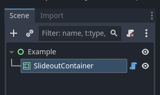
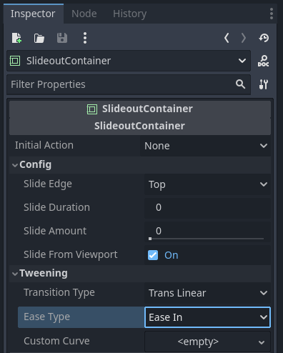
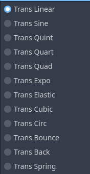

<h1>SlideoutContainer Documentation</h1>

The *SlideoutContainer* control is intended for use to do a little positional animation with the child nodes contained within. Child nodes within the *SlideoutContainer* are sized and positioned similarly to control nodes placed within a *MarginContainer* with no margins (that is to say, they stack upon one another) however, *SlideoutContainer* can then reposition those nodes outside of itself, relative to either the container itself, or the container's viewport.

---

> SlideoutContainer in a scene tree.

> SlideoutContainer inspector options.

## Inspector Options
* **Initial Action** - Determins whether the container will animate it's children when the scene starts.
    * **None** - Animation will not occure *(default)*
    * **Slide In View** - Children will be animated *into* the container. Initial position of the children will be based on **Slide Amount**
    * **Slide from View** - Children will be animated *out* of the container. Initial position of the children will be based on **Slide Amount**

#### Config
* **Slide Edge** - The direction the children positions will slide along.
    * **Top** *(default)*
    * **Bottom**
    * **Left**
    * **Right**
* **Slide Duration** - The time it will take (in seconds), when animating, for children to be moved, completely, in and out of the container (or viewport)
* **Slide Amount** - The initial offset of children relative to it's container. This is a value of **0.0** (Completely in the container, *default*) to **1.0** (completely outside the container/viewport)
* **Slide from Viewport** - If checked *(default)* children will slide out of the viewport when **Slide Amount** is set to **1.0**. If unchecked, children will be entirely contained inside the container similar to if the container was a *MarginContainer* with no margin value.

#### Tweening
* **Transition Type** - The tweening transition type used when slide animations are triggered. *(These options are the same options as used by the Tween object).*
    * 
* **Ease Type** - The tweening easing type used when slide animations are triggered. *(These options are the same options used by the Tween object).*
    * **Ease In**
    * **Ease In Out**
    * **Ease Out**
    * **Ease Out In**
* **Custom Curve** - Optionally, a curve can be defined which will dictate the slide amount offset during tween animations. **NOTE:** If a curve is defined **Transition Type** and **Ease Type** values are ignored.

## Public Methods
| Method | Arguments | Description |
| --- | --- | --- |
| slide_to() | **target** *: float*, **duration** *: float* = 0.0 | Tweens the **Slide Amount** property to the target value. Duration is how long the animation would take for all full **0.0** to **1.0** animation. *Example:* If **Slide Amount** is at 0.0, and the arguments **target** is 0.5 and **duration** is 1.0 second, the tween will actually occure over 0.5 seconds, not 1 second |
| slide_in() | **duration** *: float* = 0.0 | A shorthand for *slide_to(0.0, duration)* |
| slide_out() | **duration** *: float* = 0.0 | A shorthand for *slide_to(1.0, duration)* |
| is_sliding() | void | Returns true if an active slide animation is occuring. |
| stop_slide() | void | Stops any active slide animtion. |

## Signals
| Signal | Description |
| --- | --- |
| slide_started | Emitted before a slide animation starts. |
| slide_finished | Emitted after a slide animation finishes. |
| slide_interrupted | Emitted when a slide animation is stopped before finishing. |