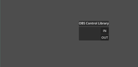
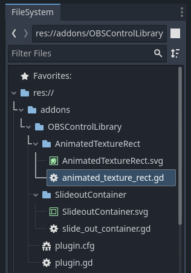
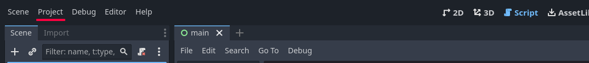
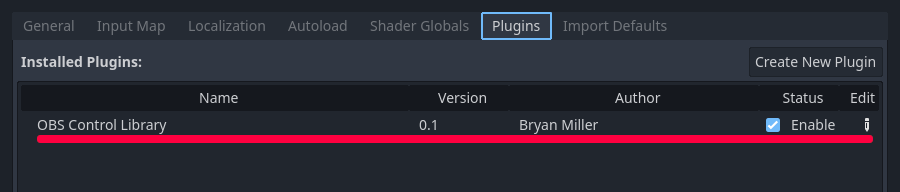

# OBS Control Library Documentation

## New Control Nodes

*  [SlideoutContainer](./SlideoutContainer/slideout_container.md) - A container that can animate child nodes sliding into or out of the container, or the active viewport.
*  [AnimatedTextureRect](./AnimatedTextureRect/animated_texture_rect.md) - An animated form of the TextureRect node, using the SpriteFrames resource for texture and animation data.
*  [AnimatedTextureButton](./AnimatedTextureButton/animated_texture_button.md) - An animated form of the TextureButton node, using the SpriteFrames resource for texture and animation data.

## Demonstration / Tutorial
I have created a Demonstration / Tutorial video showing a project being created using the [AnimatedTextureRect](./AnimatedTextureRect/animated_texture_rect.md), [AnimatedTextureButton](./AnimatedTextureButton/animated_texture_button.md), and [SlideoutContainer](./SlideoutContainer/slideout_container.md).

[The video is available here!](https://youtu.be/R2xknYgbbKQ "Addon demonstration video on YouTube")

## Installation

* Clone the OBSControlLibrary repository
* Copy the addons folder into your project's main folder.

* Select the Project -> Project Settings from the top menu.

* In the Project settings dialog window, Select the Plugins TAB and enable OBSControlLibrary

* Select the control you want to use by selecting it in the Add Child Node menu.